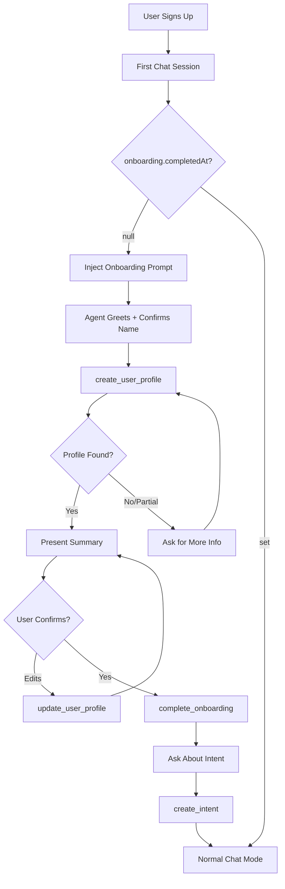

# Conversational Onboarding

## Summary

When users sign up, they provide name, email, and password. The chat agent then guides them through:

1. Confirming their identity
2. Looking them up via Parallels API (profile generation)
3. Presenting and confirming profile summary
4. Capturing their first intent

Onboarding completes when the user confirms their profile is correct.

## Architecture




## Implementation

### 1. Add `isOnboarding` to ResolvedToolContext

**File**: [protocol/src/lib/protocol/tools/tool.helpers.ts](protocol/src/lib/protocol/tools/tool.helpers.ts)

Add to `ResolvedToolContext` interface:

```typescript
isOnboarding: boolean;
```

In `resolveChatContext()`, set:

```typescript
isOnboarding: !user.onboarding?.completedAt
```

### 2. Add Onboarding Section to System Prompt

**File**: [protocol/src/lib/protocol/agents/chat.prompt.ts](protocol/src/lib/protocol/agents/chat.prompt.ts)

When `ctx.isOnboarding === true`, prepend onboarding instructions that guide the agent through:

- Greeting and name confirmation
- Profile lookup via `create_user_profile()`
- Edge case handling (not found, multiple matches, sparse signals)
- Profile presentation and confirmation
- Calling `complete_onboarding()` on confirmation
- Intent capture afterward

### 3. Add `complete_onboarding` Tool

**File**: [protocol/src/lib/protocol/tools/profile.tools.ts](protocol/src/lib/protocol/tools/profile.tools.ts)

New tool that:

- Takes no parameters
- Updates `users.onboarding.completedAt` to current timestamp
- Returns success message

### 4. Export New Tool

**File**: [protocol/src/lib/protocol/tools/index.ts](protocol/src/lib/protocol/tools/index.ts)

Include `complete_onboarding` in the tools array.

## Edge Cases (Handled by Prompt)

- **Name not found**: Ask user to describe themselves or share a public link
- **Multiple matches**: Present options, ask which one is correct
- **Sparse signals**: Proceed with available info, refine over time
- **User disagrees with bio**: Use `update_user_profile` with their corrections
- **User skips intent**: Allow skip, note that general overlap will be surfaced instead

## Existing Infrastructure Reused

- `create_user_profile` - Already calls Parallels API, handles `needsClarification`
- `update_user_profile` - Already handles profile edits
- `create_intent` - Already handles intent creation
- `users.onboarding` JSON field - Already exists in schema
- `ProfileGraph` - Already handles lookup, generation, edge cases

