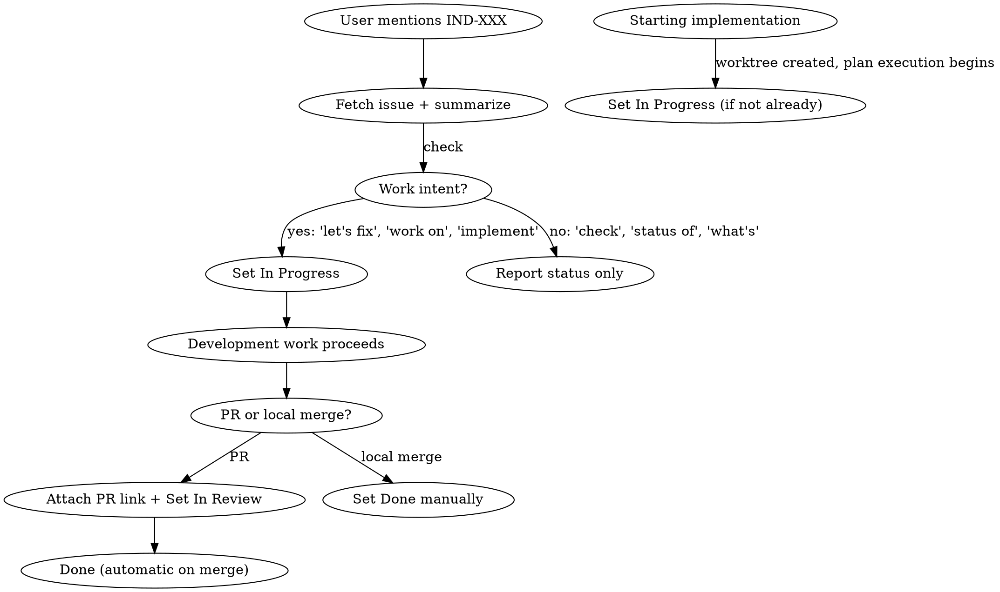

# Track Linear Progress

## Overview

Detect Linear issue references (`IND-\d+`) in conversation and manage issue status through the development lifecycle automatically. Fetch context, set In Progress, link PRs, set In Review.

## When to Use

- User mentions an issue ID like `IND-123`, `IND-42`, etc. anywhere in their message
- Pattern: `IND-\d+` (case-insensitive)

## Lifecycle



## Step 0: On Starting Implementation

If a Linear issue is tracked in the conversation and implementation begins (worktree creation, plan execution, first code change), ensure the issue is set to **In Progress** — even if it wasn't explicitly set earlier (e.g., issue was fetched but intent was ambiguous).

```
mcp__linear__save_issue(id: "IND-XXX", state: "In Progress")
```

This is a safety net: implementation starting = work intent confirmed.

## Step 1: On Issue Mention

When `IND-\d+` appears in a user message:

1. **Always fetch immediately:**
```
mcp__linear__get_issue(id: "IND-XXX")
```

2. **Summarize** the issue title, description, priority, labels, and any comments for context.

3. **Determine intent** — does the user want to **work on** this issue or just **check** it?

| Signal | Intent | Action |
|--------|--------|--------|
| "let's fix", "work on", "implement", "tackle" | Work | Set In Progress |
| "check", "status of", "what's", "look at" | Info | Report status only — do NOT change state |
| "is related to", "reminded me of", "came up", "see also" | Mention | Fetch + summarize only — incidental reference, no state change |
| Ambiguous (plausible work intent but unclear) | Ask | "Should I set IND-XXX to In Progress, or just checking?" |

4. **Guard against state regression:** If the issue is already In Review or Done, do NOT move it back to In Progress. Announce: "IND-XXX is already [status] — keeping it there."

5. **If work intent confirmed, set In Progress:**
```
mcp__linear__save_issue(id: "IND-XXX", state: "In Progress")
```

6. **Announce:** "Fetched IND-XXX: [title]. Set to In Progress."

## Step 2: On PR Creation

When creating a PR for work tied to a tracked issue (via `gh pr create` or finishing-a-development-branch):

1. **Create the PR first** (get the URL back)

2. **Attach PR and set In Review:**
```
mcp__linear__save_issue(
  id: "IND-XXX",
  state: "In Review",
  links: [{ url: "<pr-url>", title: "PR: <pr-title>" }]
)
```

3. **Announce:** "Linked PR to IND-XXX. Set to In Review."

## Step 3: On Local Merge (No PR)

If work is merged locally without a PR (e.g., finishing-a-development-branch Option 1):

1. **Set Done manually** — Linear's GitHub integration won't fire without a PR:
```
mcp__linear__save_issue(id: "IND-XXX", state: "Done")
```

2. **Announce:** "Set IND-XXX to Done (merged locally)."

## Step 4: Done via PR

Handled automatically by Linear's GitHub integration when the PR is merged. **Do not** set Done manually when a PR exists.

## Branch Naming

Derive conventional branch names from the issue context, NOT the issue ID. Per CLAUDE.md:

```
fix/login-redirect-loop       (from IND-123 "Login redirect loop bug")
feat/calendar-sync             (from IND-456 "Add calendar sync")

IND-123                        (WRONG - never use issue ID as branch name)
```

## Context Tracking

Track the active issue ID throughout the conversation. Rules:

- **Single issue mentioned:** That's the active issue. Apply automatically when creating PRs.
- **Multiple issues, clear work intent on one:** The one with work intent is active. Others are informational.
- **Multiple issues, ambiguous:** Ask "Which issue should I track for this work — IND-200 or IND-201?"

## Quick Reference

| Event | Action | Linear API Call |
|-------|--------|----------------|
| User mentions `IND-XXX` (work intent) | Fetch + summarize + set In Progress | `get_issue` then `save_issue(state: "In Progress")` |
| User mentions `IND-XXX` (info only) | Fetch + summarize | `get_issue` only |
| Implementation starts (worktree, plan, first code) | Set In Progress if not already | `save_issue(state: "In Progress")` |
| PR created | Attach PR link + set In Review | `save_issue(state: "In Review", links: [...])` |
| Local merge (no PR) | Set Done manually | `save_issue(state: "Done")` |
| PR merged | Nothing — automatic | Linear GitHub integration |

## Common Mistakes

| Mistake | Fix |
|---------|-----|
| Not fetching the issue | Always fetch — it has context, acceptance criteria, comments you need |
| Setting In Progress on informational queries | Check intent: "check status" ≠ "work on" |
| Regressing state (Done → In Progress) | Guard: never move backwards. Announce current state instead |
| Forgetting to set In Progress | Do it immediately when work intent is clear |
| Not attaching PR to issue | Always link PR URL via `save_issue(links: [...])` when creating PR |
| Using issue ID as branch name | Derive conventional branch name from issue context |
| Setting Done manually when PR exists | Linear handles this on PR merge — skip it |
| Leaving issue In Progress after local merge | No PR = no auto-Done. Set Done manually |
| Starting code before reading issue | Fetch and read the full issue first — it may change your approach |
