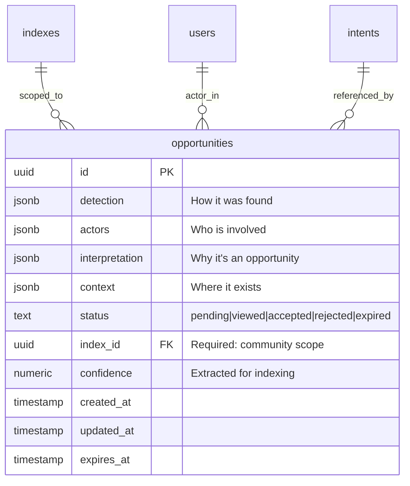
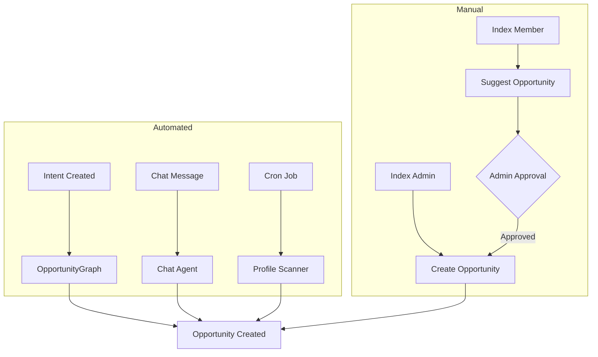
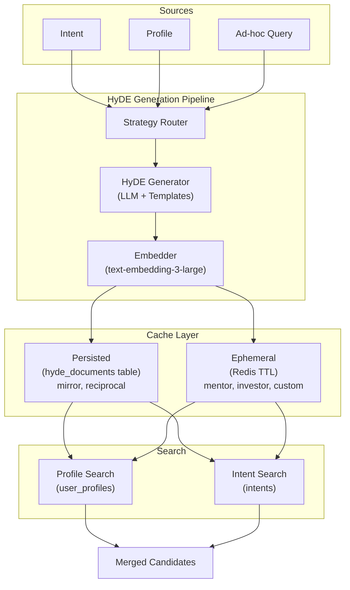
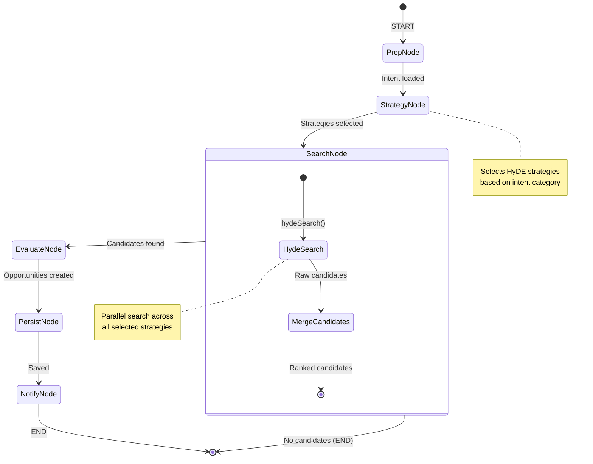
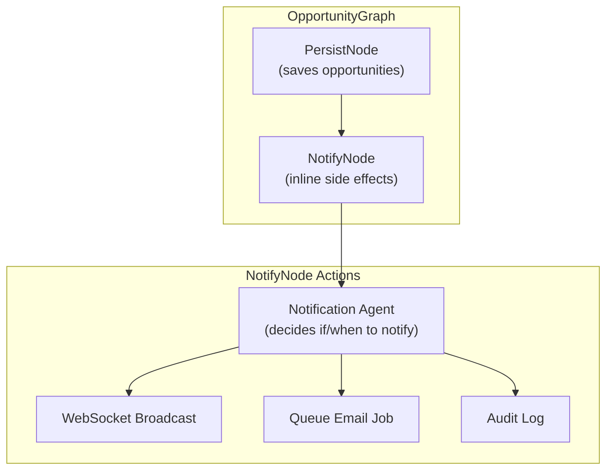
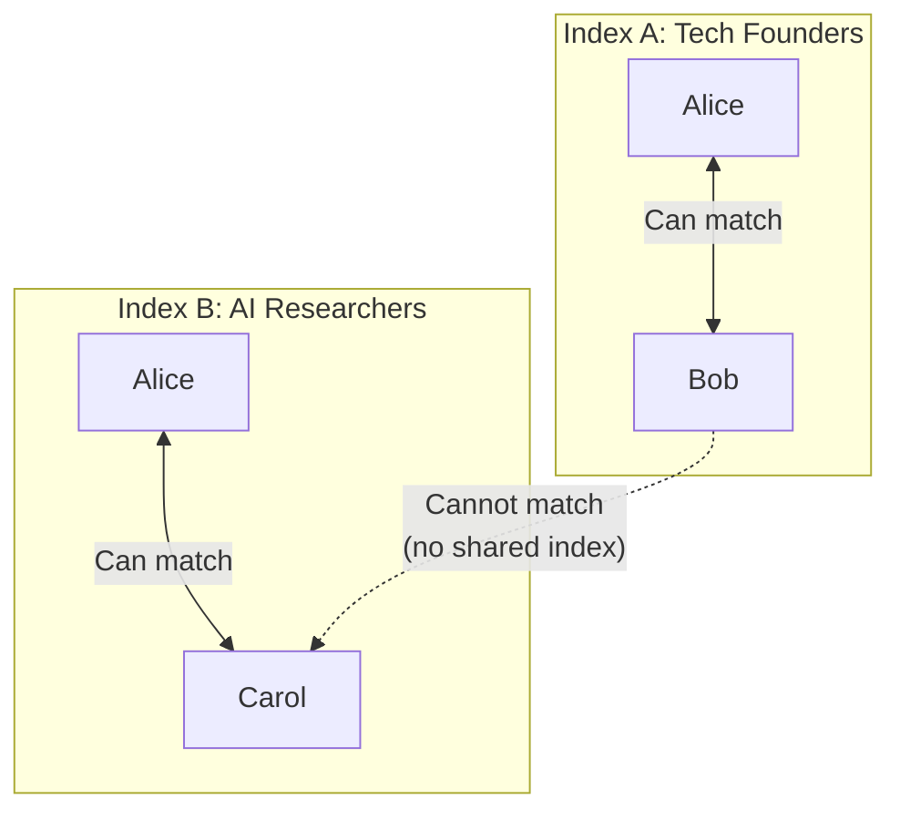
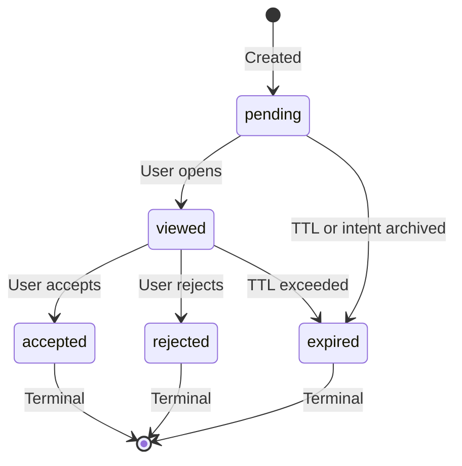

# Opportunity System Redesign Plan

> **Status**: DRAFT - Discussion Only  
> **Author**: AI Assistant  
> **Date**: 2026-02-03  
> **Version**: 2.0 (Extensible Model)

## Executive Summary

This document outlines a redesign of the Opportunity system with an **extensible, schema-flexible architecture** that:

1. **Retires `intent_stakes`** — Clean break, no migration
2. **Drops I2I/I2P distinction** — Unified opportunity model
3. **Uses extensible JSON schemas** — Focus on data sources, actors, and reasoning
4. **Enables third-party matching** — Curators can create opportunities for others
5. **Separates data from presentation** — Descriptions generated at render time
6. **Supports agent-driven notifications** — No static thresholds

---

## 1. Design Principles

### 1.1 Core Philosophy

| Principle | Description |
|-----------|-------------|
| **Data over Presentation** | Store the "what, who, why" — generate descriptions on-demand |
| **Extensible by Default** | JSON schemas evolve without migrations |
| **Actor-Centric** | Opportunities have participants with roles, not fixed source/candidate |
| **Detection Agnostic** | Same opportunity structure whether found by AI, chat, or human curator |
| **Index-Scoped** | All opportunities exist within a community context |

### 1.2 What We're NOT Doing

- ❌ Static `matchType` enum (I2I, I2P)
- ❌ Fixed `sourceUserId` / `candidateUserId` columns
- ❌ Pre-computed `sourceDescription` / `candidateDescription`
- ❌ Incognito intent handling
- ❌ Data migration from `intent_stakes`
- ❌ Static notification thresholds

---

## 2. Opportunity Data Model

### 2.1 Schema Overview

```typescript
interface Opportunity {
  id: string;
  
  // ═══════════════════════════════════════════════════════════════
  // DETECTION: How was this opportunity discovered?
  // ═══════════════════════════════════════════════════════════════
  detection: {
    source: string;           // 'opportunity_graph' | 'chat' | 'manual' | 'cron'
    createdBy?: string;       // User ID if manual, Agent ID if automated
    triggeredBy?: string;     // What triggered it (intent ID, message ID, etc.)
    timestamp: string;
  };
  
  // ═══════════════════════════════════════════════════════════════
  // ACTORS: Who is involved in this opportunity?
  // ═══════════════════════════════════════════════════════════════
  actors: Array<{
    role: string;             // 'agent' | 'patient' | 'peer' | 'introducer' | ...
    identityId: string;       // User ID
    intents?: string[];       // Associated intent IDs (can be empty)
    profile?: boolean;        // Was profile used in matching?
  }>;
  
  // ═══════════════════════════════════════════════════════════════
  // INTERPRETATION: Why is this an opportunity?
  // ═══════════════════════════════════════════════════════════════
  interpretation: {
    category: string;         // 'collaboration' | 'hiring' | 'investment' | 'mentorship' | ...
    summary: string;          // Human-readable reasoning (NOT presentation copy)
    confidence: number;       // 0-1 score
    signals?: Array<{         // What signals contributed to this match?
      type: string;           // 'intent_match' | 'profile_similarity' | 'curator_judgment'
      weight: number;
      detail?: string;
    }>;
  };
  
  // ═══════════════════════════════════════════════════════════════
  // CONTEXT: Where does this opportunity exist?
  // ═══════════════════════════════════════════════════════════════
  context: {
    indexId: string;          // Required: community scope
    conversationId?: string;  // If detected in chat
    triggeringIntentId?: string;  // Primary intent that triggered discovery
  };
  
  // ═══════════════════════════════════════════════════════════════
  // LIFECYCLE
  // ═══════════════════════════════════════════════════════════════
  status: 'pending' | 'viewed' | 'accepted' | 'rejected' | 'expired';
  createdAt: string;
  updatedAt: string;
  expiresAt?: string;
}
```

### 2.2 Entity Relationship



### 2.3 Example Opportunities

#### AI-Detected Match (Graph)
```json
{
  "detection": {
    "source": "opportunity_graph",
    "createdBy": "agent-opportunity-finder",
    "triggeredBy": "intent-abc123",
    "timestamp": "2026-02-03T10:00:00Z"
  },
  "actors": [
    { "role": "agent", "identityId": "alice-id", "intents": ["intent-abc123"], "profile": true },
    { "role": "patient", "identityId": "bob-id", "intents": ["intent-xyz789"], "profile": false }
  ],
  "interpretation": {
    "category": "hiring",
    "summary": "Alice is looking for a React developer; Bob has indicated availability for React contract work",
    "confidence": 0.87,
    "signals": [
      { "type": "intent_reciprocal", "weight": 0.8, "detail": "Complementary intents detected" },
      { "type": "profile_skills", "weight": 0.2, "detail": "Bob's profile lists React expertise" }
    ]
  },
  "context": {
    "indexId": "tech-founders-index",
    "triggeringIntentId": "intent-abc123"
  },
  "status": "pending"
}
```

#### Chat-Detected Match
```json
{
  "detection": {
    "source": "chat",
    "createdBy": "agent-chat-router",
    "triggeredBy": "message-12345",
    "timestamp": "2026-02-03T10:00:00Z"
  },
  "actors": [
    { "role": "peer", "identityId": "alice-id", "intents": [], "profile": true },
    { "role": "peer", "identityId": "bob-id", "intents": [], "profile": true }
  ],
  "interpretation": {
    "category": "collaboration",
    "summary": "During conversation, Alice mentioned interest in Web3 gaming; Bob is building in this space",
    "confidence": 0.72,
    "signals": [
      { "type": "conversation_context", "weight": 1.0, "detail": "Extracted from chat message" }
    ]
  },
  "context": {
    "indexId": "web3-builders-index",
    "conversationId": "chat-session-456"
  },
  "status": "pending"
}
```

#### Manual Curator Match
```json
{
  "detection": {
    "source": "manual",
    "createdBy": "carol-curator-id",
    "timestamp": "2026-02-03T10:00:00Z"
  },
  "actors": [
    { "role": "party", "identityId": "alice-id", "intents": ["intent-111"], "profile": true },
    { "role": "party", "identityId": "bob-id", "intents": [], "profile": true },
    { "role": "introducer", "identityId": "carol-curator-id", "intents": [] }
  ],
  "interpretation": {
    "category": "collaboration",
    "summary": "Alice is building an AI tool and Bob has ML expertise - seems like a great fit",
    "confidence": 0.85,
    "signals": [
      { "type": "curator_judgment", "weight": 1.0, "detail": "Manual match by index admin" }
    ]
  },
  "context": {
    "indexId": "ai-founders-index"
  },
  "status": "pending"
}
```

---

## 3. Actor Roles (Valency)

### 3.1 Core Roles

| Role | Description | UI Framing |
|------|-------------|------------|
| **agent** | Can DO something for others | "Someone who can help you" |
| **patient** | NEEDS something from others | "Someone you can help" |
| **peer** | Symmetric collaboration | "Potential collaborator" |
| **introducer** | Created/facilitated the match | "Introduced by..." |
| **party** | Generic participant (for manual matches) | Context-dependent |

### 3.2 Strategy-Derived Roles

These roles are automatically assigned based on which HyDE strategy found the match:

| Role | Description | Derived From Strategy |
|------|-------------|----------------------|
| **mentor** | Teaches/guides | `mentor` HyDE |
| **mentee** | Learns/receives guidance | `mentor` HyDE (source) |
| **investor** | Provides capital | `investor` HyDE |
| **founder** | Seeks capital | `investor` HyDE (source) |

### 3.3 Future Roles

| Role | Description | Use Case |
|------|-------------|----------|
| **referrer** | Knows relevant people | Network expansion |

### 3.4 Role Assignment

Roles are assigned by:
1. **HyDE Strategy** — Primary method: roles derived from which search strategy found the match (see `deriveRolesFromStrategy()` in Section 9.5)
2. **Curator Selection** — When manually creating opportunities
3. **Conversation Context** — When detected in chat

```typescript
// Role derivation from HyDE strategy (no LLM call needed)
function deriveRolesFromStrategy(strategy: HydeStrategy): { source: string; candidate: string } {
  switch (strategy) {
    case 'mirror':     return { source: 'patient', candidate: 'agent' };
    case 'reciprocal': return { source: 'peer', candidate: 'peer' };
    case 'mentor':     return { source: 'mentee', candidate: 'mentor' };
    case 'investor':   return { source: 'founder', candidate: 'investor' };
    case 'hiree':      return { source: 'agent', candidate: 'patient' };
    case 'collaborator': return { source: 'peer', candidate: 'peer' };
    default:           return { source: 'party', candidate: 'party' };
  }
}
```

This approach eliminates the need for an LLM call to determine roles, as the HyDE strategy semantically encodes the relationship type.

---

## 4. Detection Sources

### 4.1 Automated Detection

| Source | Trigger | Description |
|--------|---------|-------------|
| `opportunity_graph` | Intent created/updated | Background graph runs HyDE matching |
| `chat` | Message in conversation | Chat agent identifies opportunity during dialogue |
| `cron` | Scheduled job | Periodic re-scan for stale profiles/intents |
| `member_added` | User joins index | Scan new member against existing members |

### 4.2 Manual Detection

| Source | Trigger | Description |
|--------|---------|-------------|
| `manual` | Curator action | Index admin creates opportunity for two members |
| `request` | User request | User requests introduction to another member |
| `suggestion` | Non-admin suggestion | Member suggests match (requires approval) |

### 4.3 Detection Flow



---

## 5. HyDE Generation Pipeline

### 5.1 Core Concept

HyDE (Hypothetical Document Embeddings) solves the **cross-voice retrieval problem**. When searching for matches, the source and target documents are written in different perspectives:

| Source | Target | Problem |
|--------|--------|---------|
| Intent: "I need a Rust developer" | Profile: "I'm a Rust dev with 5 years..." | Different voice/perspective |
| Intent: "Looking for seed funding" | Intent: "Looking to invest in early-stage" | Complementary but not lexically similar |
| Chat query: "Find me a mentor" | Profile: "I mentor founders in..." | Ad-hoc query vs structured data |

HyDE bridges this by generating a **hypothetical document in the target's voice**, then searching for real matches against that embedding.

### 5.2 Architecture Overview



### 5.3 Strategy Registry

HyDE strategies are composable templates that define how to generate hypothetical documents:

```typescript
// hyde.strategies.ts

interface HydeStrategyConfig {
  targetCorpus: 'profiles' | 'intents';
  prompt: (source: string, context?: HydeContext) => string;
  persist: boolean;      // Store in DB or ephemeral?
  cacheTTL?: number;     // Redis TTL in seconds (if not persisted)
}

const HYDE_STRATEGIES: Record<string, HydeStrategyConfig> = {
  // ═══════════════════════════════════════════════════════════════
  // CORE STRATEGIES (Pre-computed at intent creation)
  // ═══════════════════════════════════════════════════════════════
  
  mirror: {
    targetCorpus: 'profiles',
    prompt: (intent) => `
      Write a professional biography for the ideal person who can satisfy this goal:
      "${intent}"
      
      Include their expertise, experience, and what they're currently focused on.
      Write in first person as if they are describing themselves.
    `,
    persist: true,
  },
  
  reciprocal: {
    targetCorpus: 'intents',
    prompt: (intent) => `
      Write a goal or aspiration statement for someone who is looking for exactly 
      what this person offers or needs:
      "${intent}"
      
      Write from the first person perspective as if stating their own goal.
    `,
    persist: true,
  },
  
  // ═══════════════════════════════════════════════════════════════
  // CATEGORY STRATEGIES (Generated on-demand, cached)
  // ═══════════════════════════════════════════════════════════════
  
  mentor: {
    targetCorpus: 'profiles',
    prompt: (intent) => `
      Write a mentor profile for someone who could guide a person with this goal:
      "${intent}"
      
      Describe their background, what they've achieved, and how they help others.
      Write in first person.
    `,
    persist: false,
    cacheTTL: 3600,  // 1 hour
  },
  
  investor: {
    targetCorpus: 'profiles',
    prompt: (intent) => `
      Write an investor thesis for someone who would be interested in funding:
      "${intent}"
      
      Include their investment focus, stage preference, and what they look for.
      Write in first person.
    `,
    persist: false,
    cacheTTL: 3600,
  },
  
  collaborator: {
    targetCorpus: 'intents',
    prompt: (intent) => `
      Write a collaboration-seeking statement for someone who would be a great 
      peer partner for this person:
      "${intent}"
      
      Focus on complementary skills and shared interests.
      Write in first person.
    `,
    persist: false,
    cacheTTL: 3600,
  },
  
  hiree: {
    targetCorpus: 'intents',
    prompt: (intent) => `
      Write a job-seeking statement for someone who would be perfect for:
      "${intent}"
      
      Describe what role they're looking for and their relevant experience.
      Write in first person.
    `,
    persist: false,
    cacheTTL: 3600,
  },
};
```

### 5.4 HyDE Storage Schema

```sql
-- Dedicated table for HyDE documents (replaces columns on intents)
CREATE TABLE hyde_documents (
  id UUID PRIMARY KEY DEFAULT gen_random_uuid(),
  
  -- Source reference
  source_type TEXT NOT NULL,        -- 'intent' | 'profile' | 'query'
  source_id UUID,                    -- FK to source (nullable for ad-hoc queries)
  source_text TEXT,                  -- For ad-hoc queries without entity reference
  
  -- Strategy configuration
  strategy TEXT NOT NULL,            -- 'mirror' | 'reciprocal' | 'mentor' | ...
  target_corpus TEXT NOT NULL,       -- 'profiles' | 'intents'
  
  -- Context constraints (for scoped generation)
  context JSONB,                     -- { category, indexId, ... }
  
  -- Generated content
  hyde_text TEXT NOT NULL,
  hyde_embedding vector(2000) NOT NULL,
  
  -- Lifecycle
  created_at TIMESTAMP WITH TIME ZONE NOT NULL DEFAULT NOW(),
  expires_at TIMESTAMP WITH TIME ZONE,  -- Staleness control
  
  -- Prevent duplicate HyDE for same source+strategy
  CONSTRAINT hyde_source_strategy_unique 
    UNIQUE NULLS NOT DISTINCT (source_type, source_id, strategy, target_corpus)
);

-- Fast lookup by source
CREATE INDEX hyde_source_idx ON hyde_documents(source_type, source_id);

-- Fast lookup by strategy (for bulk refresh)
CREATE INDEX hyde_strategy_idx ON hyde_documents(strategy);

-- Vector similarity search (when searching FROM hyde)
CREATE INDEX hyde_embedding_idx ON hyde_documents 
USING hnsw (hyde_embedding vector_cosine_ops);

-- Cleanup expired HyDE
CREATE INDEX hyde_expires_idx ON hyde_documents(expires_at) 
WHERE expires_at IS NOT NULL;
```

### 5.5 Drizzle Schema

```typescript
// schemas/hyde.schema.ts

import { pgTable, uuid, text, jsonb, timestamp, index, uniqueIndex } from 'drizzle-orm/pg-core';
import { vector } from 'pgvector/drizzle-orm';

export type HydeSourceType = 'intent' | 'profile' | 'query';
export type HydeTargetCorpus = 'profiles' | 'intents';
export type HydeStrategy = 'mirror' | 'reciprocal' | 'mentor' | 'investor' | 'collaborator' | 'hiree' | 'custom';

export interface HydeContext {
  category?: string;
  indexId?: string;
  customPrompt?: string;
}

export const hydeDocuments = pgTable('hyde_documents', {
  id: uuid('id').primaryKey().defaultRandom(),
  
  // Source
  sourceType: text('source_type').$type<HydeSourceType>().notNull(),
  sourceId: uuid('source_id'),
  sourceText: text('source_text'),
  
  // Strategy
  strategy: text('strategy').$type<HydeStrategy>().notNull(),
  targetCorpus: text('target_corpus').$type<HydeTargetCorpus>().notNull(),
  
  // Context
  context: jsonb('context').$type<HydeContext>(),
  
  // Content
  hydeText: text('hyde_text').notNull(),
  hydeEmbedding: vector('hyde_embedding', { dimensions: 2000 }).notNull(),
  
  // Lifecycle
  createdAt: timestamp('created_at', { withTimezone: true }).notNull().defaultNow(),
  expiresAt: timestamp('expires_at', { withTimezone: true }),
}, (table) => ({
  sourceIdx: index('hyde_source_idx').on(table.sourceType, table.sourceId),
  strategyIdx: index('hyde_strategy_idx').on(table.strategy),
  expiresIdx: index('hyde_expires_idx').on(table.expiresAt),
}));
```

### 5.6 HyDE Generation Service

```typescript
// services/hyde.service.ts

interface HydeGenerationParams {
  source: Intent | UserProfile | string;
  strategy: HydeStrategy;
  context?: HydeContext;
  forceRegenerate?: boolean;
}

interface HydeDocument {
  id: string;
  hydeText: string;
  hydeEmbedding: number[];
  strategy: HydeStrategy;
  targetCorpus: HydeTargetCorpus;
}

class HydeService {
  /**
   * Get existing HyDE or generate new one
   */
  async getOrGenerate(params: HydeGenerationParams): Promise<HydeDocument> {
    const { source, strategy, context, forceRegenerate } = params;
    const { sourceType, sourceId, sourceText } = this.normalizeSource(source);
    
    // Check cache (DB for persisted, Redis for ephemeral)
    if (!forceRegenerate) {
      const cached = await this.getCached(sourceType, sourceId, strategy);
      if (cached && !this.isExpired(cached)) {
        return cached;
      }
    }
    
    // Generate new HyDE
    const strategyConfig = HYDE_STRATEGIES[strategy];
    if (!strategyConfig) {
      throw new Error(`Unknown HyDE strategy: ${strategy}`);
    }
    
    // Generate hypothetical document text
    const hydeText = await this.generateHydeText(sourceText, strategyConfig, context);
    
    // Embed the hypothetical document
    const hydeEmbedding = await this.embed(hydeText);
    
    // Cache appropriately
    const hyde = await this.cache({
      sourceType,
      sourceId,
      sourceText: typeof source === 'string' ? source : undefined,
      strategy,
      targetCorpus: strategyConfig.targetCorpus,
      context,
      hydeText,
      hydeEmbedding,
      expiresAt: strategyConfig.persist ? null : this.calculateExpiry(strategyConfig.cacheTTL),
    });
    
    return hyde;
  }
  
  /**
   * Pre-generate core HyDE strategies for an intent
   */
  async pregenerate(intent: Intent): Promise<void> {
    await Promise.all([
      this.getOrGenerate({ source: intent, strategy: 'mirror' }),
      this.getOrGenerate({ source: intent, strategy: 'reciprocal' }),
    ]);
  }
  
  /**
   * Refresh HyDE when intent is updated
   */
  async refresh(intentId: string): Promise<void> {
    const intent = await db.query.intents.findFirst({ where: eq(intents.id, intentId) });
    if (!intent) return;
    
    // Force regenerate persisted strategies
    await Promise.all([
      this.getOrGenerate({ source: intent, strategy: 'mirror', forceRegenerate: true }),
      this.getOrGenerate({ source: intent, strategy: 'reciprocal', forceRegenerate: true }),
    ]);
    
    // Invalidate cached category strategies
    await this.invalidateCached(intentId);
  }
  
  private async generateHydeText(
    sourceText: string, 
    config: HydeStrategyConfig, 
    context?: HydeContext
  ): Promise<string> {
    const prompt = config.prompt(sourceText, context);
    
    const result = await llm.invoke([
      { role: 'system', content: 'Generate the requested hypothetical document. Be specific and detailed.' },
      { role: 'user', content: prompt }
    ]);
    
    return result.content as string;
  }
}
```

### 5.7 HyDE-Powered Search

```typescript
// services/hyde.search.ts

interface HydeSearchParams {
  source: Intent | UserProfile | string;
  strategies: HydeStrategy[];
  indexScope: string[];           // Which indexes to search within
  excludeUserId?: string;         // Exclude self-matches
  limit?: number;
}

interface HydeCandidate {
  type: 'profile' | 'intent';
  id: string;
  userId: string;
  score: number;
  matchedVia: HydeStrategy;
  indexId: string;
}

async function hydeSearch(params: HydeSearchParams): Promise<HydeCandidate[]> {
  const { source, strategies, indexScope, excludeUserId, limit = 10 } = params;
  
  // 1. Get or generate HyDE for each strategy (parallel)
  const hydeDocuments = await Promise.all(
    strategies.map(strategy => hydeService.getOrGenerate({ source, strategy }))
  );
  
  // 2. Run parallel searches against target corpora
  const searchPromises = hydeDocuments.map(async (hyde) => {
    if (hyde.targetCorpus === 'profiles') {
      return searchProfiles({
        embedding: hyde.hydeEmbedding,
        indexScope,
        excludeUserId,
        limit,
      }).then(results => results.map(r => ({ ...r, matchedVia: hyde.strategy })));
    } else {
      return searchIntents({
        embedding: hyde.hydeEmbedding,
        indexScope,
        excludeUserId,
        limit,
      }).then(results => results.map(r => ({ ...r, matchedVia: hyde.strategy })));
    }
  });
  
  const allResults = await Promise.all(searchPromises);
  
  // 3. Merge, deduplicate, and rank
  return mergeAndRankCandidates(allResults.flat(), limit);
}

function mergeAndRankCandidates(
  candidates: HydeCandidate[], 
  limit: number
): HydeCandidate[] {
  // Group by userId (same person might match multiple strategies)
  const byUser = new Map<string, HydeCandidate[]>();
  for (const c of candidates) {
    const existing = byUser.get(c.userId) || [];
    existing.push(c);
    byUser.set(c.userId, existing);
  }
  
  // Score aggregation: boost users who match multiple strategies
  const scored = Array.from(byUser.entries()).map(([userId, matches]) => {
    const bestMatch = matches.reduce((a, b) => a.score > b.score ? a : b);
    const strategyBonus = (matches.length - 1) * 0.1;  // 10% boost per additional strategy
    return {
      ...bestMatch,
      score: Math.min(bestMatch.score + strategyBonus, 1.0),
      matchedStrategies: matches.map(m => m.matchedVia),
    };
  });
  
  // Sort by score and limit
  return scored
    .sort((a, b) => b.score - a.score)
    .slice(0, limit);
}
```

### 5.8 Strategy Selection

The OpportunityGraph selects which HyDE strategies to use based on context:

```typescript
// opportunity.graph.ts

function selectStrategies(intent: Intent, context?: { category?: string }): HydeStrategy[] {
  // Always include core strategies
  const strategies: HydeStrategy[] = ['mirror', 'reciprocal'];
  
  // Add category-specific strategies
  const category = context?.category || intent.category;
  
  switch (category) {
    case 'hiring':
      strategies.push('hiree');
      break;
    case 'fundraising':
    case 'investment':
      strategies.push('investor');
      break;
    case 'mentorship':
    case 'learning':
      strategies.push('mentor');
      break;
    case 'collaboration':
      strategies.push('collaborator');
      break;
  }
  
  return strategies;
}
```

### 5.9 Signals in Interpretation

When an opportunity is created, the `interpretation.signals` array tracks which HyDE strategy contributed:

```json
{
  "signals": [
    { "type": "mirror", "weight": 0.6, "detail": "Profile matched via mirror HyDE" },
    { "type": "reciprocal", "weight": 0.3, "detail": "Intent matched via reciprocal HyDE" },
    { "type": "mentor", "weight": 0.1, "detail": "Profile matched via mentor HyDE" }
  ]
}
```

### 5.10 Chat Integration

For ad-hoc discovery queries in chat:

```typescript
// chat.nodes.ts

const discoverNode = async (state: ChatGraphState) => {
  const { userQuery, userId, currentIndexId } = state;
  
  // Analyze query to determine appropriate strategies
  const strategies = analyzeQueryForStrategies(userQuery);
  // e.g., "find me a mentor" → ['mentor', 'mirror']
  // e.g., "who needs help with React?" → ['reciprocal', 'hiree']
  
  // Run HyDE search with the query string as source
  const candidates = await hydeSearch({
    source: userQuery,  // Ad-hoc string, not a persisted intent
    strategies,
    indexScope: [currentIndexId],
    excludeUserId: userId,
    limit: 5,
  });
  
  return { candidates, responseType: 'discovery_results' };
};
```

### 5.11 HyDE Lifecycle Management

| Event | Action |
|-------|--------|
| Intent created | Pre-generate `mirror` + `reciprocal` HyDE |
| Intent updated | Regenerate persisted HyDE, invalidate cached |
| Intent archived | Soft-delete associated HyDE (or let expire) |
| Cron (daily) | Clean up expired ephemeral HyDE |
| Cron (weekly) | Refresh stale persisted HyDE (> 30 days old) |

```typescript
// jobs/hyde.maintenance.ts

async function cleanupExpiredHyde() {
  await db.delete(hydeDocuments)
    .where(and(
      isNotNull(hydeDocuments.expiresAt),
      lt(hydeDocuments.expiresAt, new Date())
    ));
}

async function refreshStaleHyde() {
  const staleThreshold = new Date(Date.now() - 30 * 24 * 60 * 60 * 1000);
  
  const staleHyde = await db.select()
    .from(hydeDocuments)
    .where(and(
      eq(hydeDocuments.sourceType, 'intent'),
      isNull(hydeDocuments.expiresAt),  // Persisted only
      lt(hydeDocuments.createdAt, staleThreshold)
    ));
  
  for (const hyde of staleHyde) {
    await hydeService.refresh(hyde.sourceId);
  }
}
```

---

## 6. Database Schema

### 6.1 SQL Definition

```sql
-- Main opportunities table
CREATE TABLE opportunities (
  id UUID PRIMARY KEY DEFAULT gen_random_uuid(),
  
  -- Extensible JSON fields
  detection JSONB NOT NULL,
  actors JSONB NOT NULL,
  interpretation JSONB NOT NULL,
  context JSONB NOT NULL,
  
  -- Indexed fields (extracted for queries)
  index_id UUID NOT NULL REFERENCES indexes(id),
  confidence NUMERIC NOT NULL,
  status TEXT NOT NULL DEFAULT 'pending' 
    CHECK (status IN ('pending', 'viewed', 'accepted', 'rejected', 'expired')),
  
  -- Timestamps
  created_at TIMESTAMP WITH TIME ZONE NOT NULL DEFAULT NOW(),
  updated_at TIMESTAMP WITH TIME ZONE NOT NULL DEFAULT NOW(),
  expires_at TIMESTAMP WITH TIME ZONE
);

-- Index for finding opportunities by actor
CREATE INDEX opportunities_actors_idx ON opportunities 
USING GIN (actors jsonb_path_ops);

-- Index for finding opportunities by index
CREATE INDEX opportunities_index_idx ON opportunities(index_id);

-- Index for status queries
CREATE INDEX opportunities_status_idx ON opportunities(status);

-- Index for expiration cron
CREATE INDEX opportunities_expires_idx ON opportunities(expires_at) 
WHERE expires_at IS NOT NULL;

-- Composite for common query: user's pending opportunities in an index
CREATE INDEX opportunities_actor_index_status_idx ON opportunities 
USING GIN (actors jsonb_path_ops) 
WHERE status = 'pending';
```

### 6.2 Query Examples

```sql
-- Find all opportunities for a user
SELECT * FROM opportunities 
WHERE actors @> '[{"identityId": "user-123"}]'::jsonb
ORDER BY created_at DESC;

-- Find opportunities where user is the "agent" role
SELECT * FROM opportunities 
WHERE actors @> '[{"identityId": "user-123", "role": "agent"}]'::jsonb;

-- Find manual opportunities (curator-created)
SELECT * FROM opportunities 
WHERE detection->>'source' = 'manual';

-- Find opportunities with high confidence
SELECT * FROM opportunities 
WHERE confidence > 0.8 
ORDER BY confidence DESC;

-- Find opportunities involving a specific intent
SELECT * FROM opportunities 
WHERE actors @> '[{"intents": ["intent-abc123"]}]'::jsonb;
```

### 6.3 Drizzle Schema

```typescript
// schemas/database.schema.ts

import { pgTable, uuid, jsonb, text, numeric, timestamp, index } from 'drizzle-orm/pg-core';

// JSON type definitions
export interface OpportunityDetection {
  source: string;
  createdBy?: string;
  triggeredBy?: string;
  timestamp: string;
}

export interface OpportunityActor {
  role: string;
  identityId: string;
  intents?: string[];
  profile?: boolean;
}

export interface OpportunitySignal {
  type: string;
  weight: number;
  detail?: string;
}

export interface OpportunityInterpretation {
  category: string;
  summary: string;
  confidence: number;
  signals?: OpportunitySignal[];
}

export interface OpportunityContext {
  indexId: string;
  conversationId?: string;
  triggeringIntentId?: string;
}

export const opportunityStatusEnum = pgEnum('opportunity_status', [
  'pending', 'viewed', 'accepted', 'rejected', 'expired'
]);

export const opportunities = pgTable('opportunities', {
  id: uuid('id').primaryKey().defaultRandom(),
  
  // Extensible JSON fields
  detection: jsonb('detection').$type<OpportunityDetection>().notNull(),
  actors: jsonb('actors').$type<OpportunityActor[]>().notNull(),
  interpretation: jsonb('interpretation').$type<OpportunityInterpretation>().notNull(),
  context: jsonb('context').$type<OpportunityContext>().notNull(),
  
  // Indexed fields
  indexId: uuid('index_id').notNull().references(() => indexes.id),
  confidence: numeric('confidence').notNull(),
  status: opportunityStatusEnum('status').notNull().default('pending'),
  
  // Timestamps
  createdAt: timestamp('created_at', { withTimezone: true }).notNull().defaultNow(),
  updatedAt: timestamp('updated_at', { withTimezone: true }).notNull().defaultNow(),
  expiresAt: timestamp('expires_at', { withTimezone: true }),
});
```

---

## 7. Presentation Layer

### 7.1 Descriptions Generated On-Demand

Descriptions are NOT stored. They are generated at render time based on:
- Viewer's identity (which actor am I?)
- Viewer's role in the opportunity
- Context (email, push notification, UI card)

```typescript
// services/opportunity.presentation.ts

interface OpportunityPresentation {
  title: string;
  description: string;
  callToAction: string;
}

function presentOpportunity(
  opp: Opportunity, 
  viewerId: string,
  format: 'card' | 'email' | 'notification'
): OpportunityPresentation {
  const myActor = opp.actors.find(a => a.identityId === viewerId);
  const otherActors = opp.actors.filter(a => a.identityId !== viewerId && a.role !== 'introducer');
  const introducer = opp.actors.find(a => a.role === 'introducer');
  
  if (!myActor) {
    throw new Error('Viewer is not an actor in this opportunity');
  }
  
  // Get other party's name (from profile service)
  const otherName = await getDisplayName(otherActors[0]?.identityId);
  
  // Generate role-appropriate framing
  let title: string;
  let description: string;
  
  switch (myActor.role) {
    case 'agent':
      title = `You can help ${otherName}`;
      description = `Based on your expertise, ${otherName} might benefit from connecting with you.`;
      break;
    case 'patient':
      title = `${otherName} might be able to help you`;
      description = `${otherName} has skills that align with what you're looking for.`;
      break;
    case 'peer':
      title = `Potential collaboration with ${otherName}`;
      description = `You and ${otherName} have complementary interests.`;
      break;
    case 'party':
      if (introducer) {
        const introducerName = await getDisplayName(introducer.identityId);
        title = `${introducerName} thinks you should meet ${otherName}`;
        description = opp.interpretation.summary;
      } else {
        title = `Opportunity with ${otherName}`;
        description = opp.interpretation.summary;
      }
      break;
  }
  
  // Add interpretation context
  description += `\n\n${opp.interpretation.summary}`;
  
  // Format-specific adjustments
  if (format === 'notification') {
    description = truncate(description, 100);
  }
  
  return {
    title,
    description,
    callToAction: 'View Opportunity'
  };
}
```

### 7.2 API Response

```typescript
// GET /api/opportunities/:id
interface OpportunityResponse {
  id: string;
  
  // Presentation (generated for viewer)
  presentation: {
    title: string;
    description: string;
    callToAction: string;
  };
  
  // My role in this opportunity
  myRole: string;
  
  // Other parties (names, not full profiles)
  otherParties: Array<{
    id: string;
    name: string;
    avatar?: string;
    role: string;
  }>;
  
  // If introduced
  introducedBy?: {
    id: string;
    name: string;
    avatar?: string;
  };
  
  // Category and confidence
  category: string;
  confidence: number;
  
  // Context
  index: {
    id: string;
    title: string;
  };
  
  // Lifecycle
  status: string;
  createdAt: string;
  expiresAt?: string;
}
```

---

## 8. Manual Opportunity Creation

### 8.1 API Endpoint

```typescript
// POST /api/indexes/:indexId/opportunities

interface CreateManualOpportunityRequest {
  // Who is being matched (2+ parties)
  parties: Array<{
    userId: string;
    intentId?: string;  // Optional: link to specific intent
  }>;
  
  // Curator's reasoning
  reasoning: string;
  
  // Optional: category
  category?: string;
  
  // Optional: confidence (default 0.8 for manual)
  confidence?: number;
}

// Example request
{
  "parties": [
    { "userId": "alice-id", "intentId": "intent-123" },
    { "userId": "bob-id" }
  ],
  "reasoning": "Alice is building an AI tool, Bob has ML expertise - great fit",
  "category": "collaboration",
  "confidence": 0.85
}
```

### 8.2 Permission Model

| Creator Role | Can Create For | Approval Required |
|--------------|----------------|-------------------|
| Index Admin | Any members | No |
| Index Member (self-involved) | Self + other member | No |
| Index Member (not involved) | Any members | Yes (admin approval) |

```typescript
// middleware/opportunity.permissions.ts

async function canCreateOpportunity(
  creatorId: string, 
  partyIds: string[], 
  indexId: string
): Promise<{ allowed: boolean; requiresApproval: boolean }> {
  const isAdmin = await isIndexAdmin(creatorId, indexId);
  const isSelfIncluded = partyIds.includes(creatorId);
  
  if (isAdmin) {
    return { allowed: true, requiresApproval: false };
  }
  
  if (isSelfIncluded) {
    return { allowed: true, requiresApproval: false };
  }
  
  // Non-admin, not involved → needs approval
  return { allowed: true, requiresApproval: true };
}
```

### 8.3 Transformation to Opportunity

```typescript
// services/opportunity.service.ts

async function createManualOpportunity(
  indexId: string,
  creatorId: string,
  request: CreateManualOpportunityRequest
): Promise<Opportunity> {
  const { parties, reasoning, category, confidence } = request;
  
  // Build actors array
  const actors: OpportunityActor[] = parties.map(p => ({
    role: 'party',  // Manual matches use generic 'party' role
    identityId: p.userId,
    intents: p.intentId ? [p.intentId] : [],
    profile: true
  }));
  
  // Add introducer (the creator)
  actors.push({
    role: 'introducer',
    identityId: creatorId,
    intents: []
  });
  
  const opportunity: NewOpportunity = {
    detection: {
      source: 'manual',
      createdBy: creatorId,
      timestamp: new Date().toISOString()
    },
    actors,
    interpretation: {
      category: category || 'collaboration',
      summary: reasoning,
      confidence: confidence || 0.8,
      signals: [
        { type: 'curator_judgment', weight: 1.0, detail: 'Manual match by curator' }
      ]
    },
    context: {
      indexId
    },
    indexId,
    confidence: confidence || 0.8,
    status: 'pending'
  };
  
  return await db.insert(opportunities).values(opportunity).returning();
}
```

---

## 9. Opportunity Graph (Automated Detection)

### 9.1 Graph Architecture



### 9.2 Graph State

```typescript
// opportunity.graph.state.ts

import { Annotation } from "@langchain/langgraph";
import { HydeStrategy, HydeCandidate } from '../hyde/hyde.types';

export const OpportunityGraphState = Annotation.Root({
  // Input
  intentId: Annotation<string>,
  userId: Annotation<string>,
  
  // Control
  operationMode: Annotation<'create' | 'refresh'>({
    default: () => 'create',
  }),
  
  // Intermediate - Intent Data
  intent: Annotation<Intent | null>({
    default: () => null,
  }),
  
  // Intermediate - Selected HyDE strategies
  selectedStrategies: Annotation<HydeStrategy[]>({
    default: () => ['mirror', 'reciprocal'],
  }),
  
  // Intermediate - User's index memberships
  userIndexIds: Annotation<string[]>({
    default: () => [],
  }),
  
  // Intermediate - Candidates from HyDE search
  candidates: Annotation<HydeCandidate[]>({
    reducer: (curr, next) => next ?? curr,
    default: () => [],
  }),
  
  // Output
  opportunities: Annotation<Opportunity[]>({
    reducer: (curr, next) => next,
    default: () => [],
  }),
});
```

### 9.3 Strategy Selection Node

```typescript
// opportunity.graph.ts - StrategyNode

const strategyNode = async (state: typeof OpportunityGraphState.State) => {
  const { intent } = state;
  
  // Select strategies based on intent category and context
  const selectedStrategies = selectStrategies(intent);
  
  return { selectedStrategies };
};

function selectStrategies(intent: Intent): HydeStrategy[] {
  const strategies: HydeStrategy[] = ['mirror', 'reciprocal'];
  
  switch (intent.category) {
    case 'hiring':
      strategies.push('hiree');
      break;
    case 'fundraising':
    case 'investment':
      strategies.push('investor');
      break;
    case 'mentorship':
    case 'learning':
      strategies.push('mentor');
      break;
    case 'collaboration':
      strategies.push('collaborator');
      break;
  }
  
  return strategies;
}
```

### 9.4 Search Node (HyDE-Powered)

```typescript
// opportunity.graph.ts - SearchNode

const searchNode = async (state: typeof OpportunityGraphState.State) => {
  const { intent, userId, selectedStrategies, userIndexIds } = state;
  
  // Use HyDE search service with selected strategies
  const candidates = await hydeSearch({
    source: intent,
    strategies: selectedStrategies,
    indexScope: userIndexIds,
    excludeUserId: userId,
    limit: 20,
  });
  
  return { candidates };
};
```

### 9.5 Opportunity Creation in Graph

```typescript
// opportunity.graph.ts - EvaluateNode

const evaluateNode = async (state: typeof OpportunityGraphState.State) => {
  const { intent, candidates, userId } = state;
  
  const opportunities: Opportunity[] = [];
  
  for (const candidate of candidates) {
    // Determine roles based on HyDE strategy used
    const roles = deriveRolesFromStrategy(candidate.matchedVia, intent, candidate);
    
    // Build actors array
    const actors: OpportunityActor[] = [
      {
        role: roles.source,
        identityId: userId,
        intents: [intent.id],
        profile: false
      },
      {
        role: roles.candidate,
        identityId: candidate.userId,
        intents: candidate.intentId ? [candidate.intentId] : [],
        profile: candidate.type === 'profile'
      }
    ];
    
    // Build interpretation
    const evaluation = await evaluateMatch(intent, candidate);
    
    // Build signals from all matched strategies
    const signals: OpportunitySignal[] = candidate.matchedStrategies 
      ? candidate.matchedStrategies.map(strategy => ({
          type: strategy,
          weight: strategy === candidate.matchedVia ? candidate.score : candidate.score * 0.8,
          detail: `Matched via ${strategy} HyDE`
        }))
      : [{ type: candidate.matchedVia, weight: candidate.score, detail: `Matched via ${candidate.matchedVia} HyDE` }];
    
    const opportunity: Opportunity = {
      detection: {
        source: 'opportunity_graph',
        createdBy: 'agent-opportunity-finder',
        triggeredBy: intent.id,
        timestamp: new Date().toISOString()
      },
      actors,
      interpretation: {
        category: evaluation.category,
        summary: evaluation.reasoning,
        confidence: evaluation.confidence,
        signals
      },
      context: {
        indexId: candidate.indexId,
        triggeringIntentId: intent.id
      },
      status: 'pending'
    };
    
    opportunities.push(opportunity);
  }
  
  return { opportunities };
};

/**
 * Derive actor roles from the HyDE strategy that found the match.
 * This reduces LLM calls by inferring roles from search semantics.
 */
function deriveRolesFromStrategy(
  strategy: HydeStrategy,
  intent: Intent,
  candidate: HydeCandidate
): { source: string; candidate: string } {
  switch (strategy) {
    case 'mirror':
      // Mirror found a profile that satisfies the intent
      // Source is seeking (patient), candidate can provide (agent)
      return { source: 'patient', candidate: 'agent' };
    
    case 'reciprocal':
      // Reciprocal found a complementary intent
      // Both are seeking, symmetric relationship
      return { source: 'peer', candidate: 'peer' };
    
    case 'mentor':
      // Mentor strategy found someone who can guide
      return { source: 'mentee', candidate: 'mentor' };
    
    case 'investor':
      // Investor strategy found potential funder
      return { source: 'founder', candidate: 'investor' };
    
    case 'hiree':
      // Hiree strategy found job seeker
      return { source: 'agent', candidate: 'patient' };
    
    case 'collaborator':
      // Collaborator strategy found peer
      return { source: 'peer', candidate: 'peer' };
    
    default:
      // Fall back to symmetric for unknown strategies
      return { source: 'party', candidate: 'party' };
  }
}
```

---

## 10. Side Effects & Notifications

### 10.1 Graph-Based Side Effects

All side effects are handled **directly within the graph** — no separate events file.



### 10.2 Agent-Driven Notifications

No static thresholds. A notification agent evaluates context:

```typescript
// NotifyNode
const notifyNode = async (state: typeof OpportunityGraphState.State) => {
  const { opportunities } = state;
  
  for (const opp of opportunities) {
    for (const actor of opp.actors) {
      if (actor.role === 'introducer') continue; // Don't notify self
      
      const shouldNotify = await notificationAgent.evaluate({
        opportunity: opp,
        userId: actor.identityId,
        factors: {
          confidence: opp.interpretation.confidence,
          detectionSource: opp.detection.source,
          userRecentActivity: await getUserActivity(actor.identityId),
          existingUnviewedCount: await getUnviewedCount(actor.identityId),
          timeOfDay: new Date().getHours(),
          category: opp.interpretation.category
        }
      });
      
      if (shouldNotify.immediate) {
        await websocketService.broadcast(actor.identityId, {
          type: 'opportunity_created',
          opportunityId: opp.id,
          preview: generatePreview(opp, actor.identityId)
        });
      }
      
      if (shouldNotify.email) {
        await emailQueue.add('opportunity_notification', {
          userId: actor.identityId,
          opportunityId: opp.id,
          priority: shouldNotify.emailPriority
        });
      }
    }
  }
};
```

### 10.3 Notification Agent Considerations

| Factor | High Priority | Low Priority |
|--------|--------------|--------------|
| Confidence | > 0.8 | < 0.6 |
| Detection source | `manual` (curator) | `cron` (background) |
| Category | `hiring`, `investment` | `networking` |
| User activity | Active in last 24h | Inactive > 7 days |
| Unviewed count | < 3 | > 10 (batch instead) |
| Time of day | Business hours | Night |

---

## 11. Index Scoping

### 11.1 Community Boundaries

All opportunities exist within an index context. Users can only match through shared index memberships.



### 11.2 Index Selection for Multi-Index Users

When users share multiple indexes, select one using this priority:

1. Index where triggering intent is assigned
2. First shared index (alphabetically by ID for determinism)

```typescript
function selectIndexForOpportunity(
  triggeringIntentId: string | null,
  sharedIndexIds: string[]
): string {
  if (triggeringIntentId) {
    const intentIndex = getIntentIndexAssignment(triggeringIntentId, sharedIndexIds);
    if (intentIndex) return intentIndex;
  }
  
  return sharedIndexIds.sort()[0];
}
```

### 11.3 Index Settings

```typescript
// indexes.settings schema
interface IndexSettings {
  opportunities?: {
    expirationDays?: number;        // Default: 30
    allowManualCreation?: boolean;  // Default: true (for admins)
    allowMemberSuggestions?: boolean; // Default: false
  };
}
```

---

## 12. Edge Cases

### 12.1 Self-Matching Prevention

```typescript
// Filter out self-matches
const validCandidates = candidates.filter(c => c.userId !== sourceUserId);
```

### 12.2 Duplicate Prevention

Use functional unique index on actor pairs per index:

```sql
-- Prevent duplicate opportunities between same actor pair in same index
CREATE UNIQUE INDEX opportunities_actors_unique ON opportunities (
  (SELECT jsonb_agg(elem->>'identityId' ORDER BY elem->>'identityId') 
   FROM jsonb_array_elements(actors) elem 
   WHERE elem->>'role' != 'introducer'),
  index_id
);
```

Alternative: Check before insert:

```typescript
async function opportunityExists(actorIds: string[], indexId: string): Promise<boolean> {
  const sorted = actorIds.sort();
  const existing = await db.select()
    .from(opportunities)
    .where(and(
      eq(opportunities.indexId, indexId),
      sql`actors @> ${JSON.stringify(sorted.map(id => ({ identityId: id })))}`
    ))
    .limit(1);
  
  return existing.length > 0;
}
```

### 12.3 Archived Intent Handling

When an intent is archived, expire related opportunities:

```typescript
async function onIntentArchived(intentId: string) {
  await db.update(opportunities)
    .set({ status: 'expired', updatedAt: new Date() })
    .where(sql`actors @> '[{"intents": ["${intentId}"]}]'::jsonb`);
}
```

### 12.4 Member Removed from Index

```typescript
async function onMemberRemoved(indexId: string, userId: string) {
  await db.update(opportunities)
    .set({ status: 'expired', updatedAt: new Date() })
    .where(and(
      eq(opportunities.indexId, indexId),
      sql`actors @> '[{"identityId": "${userId}"}]'::jsonb`,
      ne(opportunities.status, 'expired')
    ));
}
```

### 12.5 Status State Machine



---

## 13. API Endpoints

### 13.1 Opportunity CRUD

| Method | Endpoint | Description |
|--------|----------|-------------|
| `GET` | `/api/opportunities` | List opportunities for authenticated user |
| `GET` | `/api/opportunities/:id` | Get single opportunity (presentation included) |
| `PATCH` | `/api/opportunities/:id/status` | Update status (accept/reject) |
| `POST` | `/api/indexes/:indexId/opportunities` | Create manual opportunity (curator) |
| `GET` | `/api/indexes/:indexId/opportunities` | List all opportunities in index (admin) |

### 13.2 Query Parameters

```
GET /api/opportunities?status=pending&limit=20&offset=0
GET /api/opportunities?category=hiring
GET /api/opportunities?role=agent
```

---

## 14. Implementation Checklist

### Phase 1: Schema & Foundation
- [ ] Create new `opportunities` table with JSONB fields
- [ ] Add GIN indexes for actor queries
- [ ] Update Drizzle schema with TypeScript types
- [ ] Create `hyde_documents` table with vector index
- [ ] Add `settings` column to `indexes` table

### Phase 2: HyDE Generation Pipeline
- [ ] Define HyDE strategy registry (`hyde.strategies.ts`)
- [ ] Implement `HydeService` with get-or-generate logic
- [ ] Add Redis caching for ephemeral HyDE
- [ ] Implement `hydeSearch()` with multi-strategy support
- [ ] Add strategy selection logic based on intent category
- [ ] Wire HyDE pre-generation into intent creation flow
- [ ] Add HyDE refresh on intent update

### Phase 3: OpportunityGraph Integration
- [ ] Refactor `OpportunityGraph` with new state
- [ ] Replace direct vector search with `hydeSearch()`
- [ ] Implement candidate merging and ranking
- [ ] Implement `OpportunityEvaluator` for role determination
- [ ] Create presentation service for on-demand descriptions

### Phase 4: Manual Creation
- [ ] Add `POST /indexes/:indexId/opportunities` endpoint
- [ ] Implement permission model (admin vs member)
- [ ] Add suggestion/approval flow for non-admin members

### Phase 5: Notifications
- [ ] Create notification agent for smart delivery
- [ ] Add `NotifyNode` to `OpportunityGraph`
- [ ] Implement WebSocket broadcasts
- [ ] Add email queue integration

### Phase 6: Lifecycle & Maintenance
- [ ] Implement status transitions
- [ ] Add `onIntentArchived` handler
- [ ] Add `onMemberRemoved` handler
- [ ] Create opportunity expiration cron job
- [ ] Create HyDE cleanup cron job (expired ephemeral)
- [ ] Create HyDE refresh cron job (stale persisted)

### Phase 7: Chat Integration
- [ ] Add `analyzeQueryForStrategies()` for ad-hoc queries
- [ ] Implement `discoverNode` with HyDE search
- [ ] Add discovery results presentation in chat

### Phase 8: API & Frontend
- [ ] Implement all API endpoints
- [ ] Add access control middleware
- [ ] Update frontend to use presentation layer

### Phase 9: Cleanup
- [ ] Remove `SemanticRelevancyBroker`
- [ ] Drop `intent_stakes` table (clean break)
- [ ] Drop `intent_stake_items` table
- [ ] Update documentation

---

## 15. Appendix: Migration from Old Schema

### No Data Migration

Per product owner decision, we do a **clean break**:
- Do not migrate `intent_stakes` to `opportunities`
- Users start fresh with new opportunity system
- Old stakes can be archived/backed up but not converted

### Communication Plan
- Notify users that "Connections" section is being upgraded
- Existing connections (accepted stakes) remain as connections
- Unaccepted stakes are not carried over

---

## 16. Appendix: Future Extensions

### 16.1 Multi-Party Opportunities (3+ actors)
```json
{
  "actors": [
    { "role": "introducer", "identityId": "carol" },
    { "role": "party", "identityId": "alice" },
    { "role": "party", "identityId": "bob" },
    { "role": "party", "identityId": "dave" }
  ]
}
```

### 16.2 Referral Chains
```json
{
  "actors": [
    { "role": "referee", "identityId": "alice" },
    { "role": "target", "identityId": "bob" },
    { "role": "introducer", "identityId": "carol" },
    { "role": "original_referrer", "identityId": "dave" }
  ]
}
```

### 16.3 DID Integration
```typescript
actors: [
  { role: 'agent', identityId: 'did:eth:0x1234...' }
]
```

### 16.4 Cross-Index Opportunities (with permission)
```json
{
  "context": {
    "indexId": "primary-index",
    "crossIndexIds": ["secondary-index"]
  }
}
```

---

## 17. References

1. [HyDE Strategies Document](../src/lib/protocol/docs/HyDE%20Strategies%20for%20Explicit%20Intent%20Matching%20and%20Retrieval.md)
2. [LangGraph Patterns](../.cursor/rules/langgraph-patterns.mdc)
3. [File Naming Convention](../.cursor/rules/file-naming-convention.mdc)
