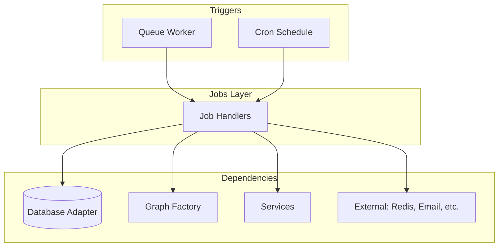

# Job Template Guide

This document provides guidelines for writing job files in this project with clean architecture in mind. It reflects patterns from [`hyde.job.ts`](hyde.job.ts), [`intent.job.ts`](intent.job.ts), [`opportunity.job.ts`](opportunity.job.ts), and [`notification.job.ts`](notification.job.ts).

## Table of Contents

1. [Architecture Overview](#architecture-overview)
2. [Job Types: Queue vs Cron](#job-types-queue-vs-cron)
3. [File Structure Conventions](#file-structure-conventions)
4. [Dependency Injection (Testing)](#dependency-injection-testing)
5. [Queue–Job Contract](#queue-job-contract)
6. [Layering and Dependencies](#layering-and-dependencies)
7. [Testing Guidelines](#testing-guidelines)
8. [Best Practices](#best-practices)
9. [Quick Reference](#quick-reference)

---

## Architecture Overview

Jobs in this project fall into two execution models:

| Model | Trigger | Location | Examples |
|-------|---------|----------|----------|
| **Queue job** | BullMQ worker (job added to queue) | `src/jobs/*.job.ts` + `src/queues/*.queue.ts` | Intent HyDE, opportunity discovery, notifications |
| **Cron job** | Scheduled (e.g. `node-cron`) | `src/jobs/*.job.ts` | HyDE cleanup, HyDE refresh |

Both live under `src/jobs/`. Queue **definitions** (name, payload types, processor wiring) live in `src/queues/`. The job file holds the **business logic**; the queue file **invokes** that logic when a job runs.



### Key Principles

1. **Job handlers are pure business logic**: They receive `data` (and optional `deps`) and perform one well-defined task. They do not create queues or workers.
2. **Queues own the worker**: The queue file creates the Worker, defines the processor that calls the job handler, and exports `addJob` (or equivalent) for enqueueing.
3. **Cron jobs are self-contained**: A job file can export both handlers (e.g. `cleanupExpiredHyde`, `refreshStaleHyde`) and an `init*Jobs()` that registers cron schedules.
4. **Testability via deps**: Handlers accept an optional `deps` object so tests can inject mocks (database, graph invoke, downstream queues) without touching real infrastructure.

---

## Job Types: Queue vs Cron

### Queue job (BullMQ)

- **Written in**: `src/jobs/{domain}.job.ts` (handlers) and `src/queues/{domain}.queue.ts` (queue, worker, `addJob`).
- **Flow**: Something (e.g. intent graph, opportunity graph) calls `addJob(...)` → BullMQ stores job → Worker runs processor → Processor calls job handler with `job.data`.
- **Payload**: Typed in the queue file (e.g. `IntentJobData`, `OpportunityJobData`) and re-exported or imported by the job file for the handler signature.

Example: Intent HyDE

- Queue: `intent.queue.ts` defines `IntentJobData`, `intentQueue`, `intentWorker`, `addJob('generate_hyde' | 'delete_hyde', data)`.
- Job: `intent.job.ts` exports `handleGenerateHyde(data, deps?)`, `handleDeleteHyde(data, deps?)`. The queue processor calls these with `job.data`.

### Cron job (node-cron)

- **Written in**: `src/jobs/{domain}.job.ts` only.
- **Flow**: On app bootstrap, something calls `init*Jobs()` (e.g. `initHydeJobs()`), which uses `cron.schedule(...)` to run handler functions at fixed times.
- **No payload**: Handlers take optional `deps` only; they decide what to do (e.g. “all expired HyDE”, “all stale HyDE”).

Example: HyDE maintenance

- `hyde.job.ts` exports `cleanupExpiredHyde(deps?)`, `refreshStaleHyde(deps?)`, and `initHydeJobs()`. `initHydeJobs()` schedules daily cleanup and weekly refresh.

---

## File Structure Conventions

### Naming

- Job file: `{domain}.job.ts` (e.g. `intent.job.ts`, `opportunity.job.ts`, `notification.job.ts`, `hyde.job.ts`).
- Queue file: `{domain}.queue.ts` (e.g. `intent.queue.ts`). Job payload types (e.g. `IntentJobData`) live in the queue file; the job file imports them if needed.

### Internal layout of a job file

```typescript
// 1. External / infra
import cron from 'node-cron';                    // only if cron
import { log } from '../lib/log';

// 2. Adapters (default implementations; tests override via deps)
import { ChatDatabaseAdapter } from '../adapters/database.adapter';
import { EmbedderAdapter } from '../adapters/embedder.adapter';

// 3. Protocol / graph
import { SomeGraphFactory } from '../lib/protocol/graphs/some.graph';
import type { SomeGraphDatabase } from '../lib/protocol/interfaces/database.interface';

// 4. Queue types (for queue jobs)
import type { SomeJobData } from '../queues/some.queue';

// 5. Downstream queues (if this job enqueues another)
import { addJob as addDownstreamJob } from '../queues/downstream.queue';

const logger = log.job.from('JobName');

// Default adapter instances (used when deps not provided)
const database = new ChatDatabaseAdapter();

// 6. Minimal DB/deps types for testing (Pick from adapter)
export type SomeJobDatabase = Pick<ChatDatabaseAdapter, 'getX' | 'saveY'>;
export interface SomeJobDeps {
  database?: SomeJobDatabase;
  invokeGraph?: (opts: GraphInput) => Promise<void>;
  addDownstreamJob?: (data: DownstreamPayload) => Promise<unknown>;
}

// 7. Handlers (queue or cron)
export async function handleDoSomething(data: SomeJobData, deps?: SomeJobDeps): Promise<void> {
  const db = deps?.database ?? database;
  // ...
}

// 8. Cron init (if applicable)
export function initSomeJobs(): void {
  cron.schedule('0 3 * * *', () => {
    handleDoSomething().catch((err) => logger.error('Cron failed', { error: err }));
  });
}
```

---

## Dependency Injection (Testing)

Job handlers **must** accept an optional second argument `deps` so tests can inject mocks and avoid real DB, graphs, and queues.

### Define minimal interfaces

Use `Pick<Adapter, 'method1' | 'method2'>` so tests only implement what the handler uses:

```typescript
export type IntentJobDatabase = Pick<
  ChatDatabaseAdapter,
  'getIntentForIndexing' | 'getUserIndexIds' | 'assignIntentToIndex' | 'deleteHydeDocumentsForSource'
>;

export interface IntentJobDeps {
  database?: IntentJobDatabase;
  invokeHyde?: (opts: HydeInvokeOptions) => Promise<void>;
  addOpportunityJob?: (data: { intentId: string; userId: string }) => Promise<unknown>;
}
```

### Use deps inside the handler

```typescript
export async function handleGenerateHyde(data: IntentJobData, deps?: IntentJobDeps): Promise<void> {
  const db = deps?.database ?? database;
  const intent = await db.getIntentForIndexing(data.intentId);
  if (!intent) {
    logger.warn('[IntentHyde] Intent not found, skipping', { intentId: data.intentId });
    return;
  }

  if (deps?.invokeHyde) {
    await deps.invokeHyde({ sourceText: intent.payload, sourceType: 'intent', sourceId: data.intentId, ... });
  } else {
    const embedder = new EmbedderAdapter();
    const hydeGraph = new HydeGraphFactory(graphDb, embedder, cache, generator).createGraph();
    await hydeGraph.invoke({ ... });
  }

  const addJob = deps?.addOpportunityJob ?? addOpportunityJob;
  await addJob({ intentId: data.intentId, userId: data.userId }).catch((err) =>
    logger.error('[IntentHyde] Failed to enqueue opportunity discovery', { ... })
  );
}
```

- **Production**: `deps` is omitted, so default adapters and real `addOpportunityJob` are used.
- **Tests**: Pass `deps` with mocks for `database`, `invokeHyde`, `addOpportunityJob` so the handler runs without real DB, graph, or queue.

---

## Queue–Job Contract

### Queue file responsibilities

- Define and export queue name constant and payload types (e.g. `IntentJobData`, `IntentDeleteData`).
- Create queue and worker via `QueueFactory`.
- Implement processor: switch on `job.name`, cast `job.data` to the right type, call the corresponding job handler (with no `deps` in production).
- Export `addJob` (or `queueOpportunityNotification`, etc.) for callers to enqueue work.

### Job file responsibilities

- Export one handler per job name (e.g. `handleGenerateHyde`, `handleDeleteHyde`).
- Use payload types imported from the queue file.
- Do not import the queue’s Worker or Queue for processing; only import `addJob` (or similar) if this job enqueues another job.

### Example wiring (intent)

**Queue** (`intent.queue.ts`):

```typescript
import { handleGenerateHyde, handleDeleteHyde } from '../jobs/intent.job';

export interface IntentJobData { intentId: string; userId: string; }
export interface IntentDeleteData { intentId: string; }

async function intentProcessor(job: Job<IntentJobPayload>) {
  switch (job.name) {
    case 'generate_hyde':
      await handleGenerateHyde(job.data as IntentJobData);
      break;
    case 'delete_hyde':
      await handleDeleteHyde(job.data as IntentDeleteData);
      break;
    default:
      logger.warn(`Unknown job name: ${job.name}`);
  }
}

export const intentWorker = QueueFactory.createWorker<IntentJobPayload>(QUEUE_NAME, intentProcessor);
export async function addJob(name: 'generate_hyde' | 'delete_hyde', data: IntentJobData | IntentDeleteData, options?) {
  return intentQueue.add(name, data, options);
}
```

**Job** (`intent.job.ts`): Imports `IntentJobData` / `IntentDeleteData` from the queue and implements `handleGenerateHyde(data, deps?)`, `handleDeleteHyde(data, deps?)`.

---

## Layering and Dependencies

### What jobs may use

- **Adapters**: Database, embedder, cache, scraper (e.g. `ChatDatabaseAdapter`, `EmbedderAdapter`, `RedisCacheAdapter`). Prefer a single adapter type and narrow with `Pick` or type assertions only where the graph expects a protocol interface.
- **Protocol layer**: Graph factories, agents (e.g. `HydeGraphFactory`, `OpportunityGraphFactory`, `HydeGenerator`). Invoke graphs with the right database/view (e.g. `HydeGraphDatabase`).
- **Services**: When business logic is already in a service (e.g. `userService.getUserForNewsletter`), use it instead of duplicating or bypassing it.
- **Queues**: Only to **enqueue** downstream work (e.g. intent job enqueuing opportunity job). Do not depend on the queue’s Worker inside the job.
- **Infrastructure**: Redis (e.g. for digest lists, dedupe keys), email queue, event emitters (e.g. WebSocket notification events).

### What jobs should avoid

- **Direct `db` or schema**: Prefer adapters so tests can inject a minimal DB interface.
- **Creating Workers or Queues**: That belongs in the queue file (or app bootstrap for crons).
- **Controller or HTTP concerns**: No `Request`/`Response`; jobs are backend-only.

### Prefer services when they exist

If a piece of logic (e.g. “get user for newsletter”) already lives in a service, call the service from the job instead of reimplementing or reaching into adapters that the service already uses. This keeps a single place for that logic and preserves testability at the service layer.

---

## Testing Guidelines

### Test file location and naming

- `src/jobs/tests/{domain}.job.spec.ts` (e.g. `hyde.job.spec.ts`, `notification.job.spec.ts`).

### Use deps to isolate behavior

- **Queue job tests**: Pass `deps` with mocked `database`, optional `invokeGraph`, and optional `addDownstreamJob`. Assert that the handler calls the right methods with the right arguments and that it does not throw when dependencies behave as expected.
- **Cron job tests**: Pass `deps` so no real DB or graph is used; assert return values or side effects (e.g. mock `deleteExpiredHydeDocuments` and expect `cleanupExpiredHyde(deps)` to return the mocked count).
- **init*Jobs**: Test that `initSomeJobs()` does not throw (scheduling is the only side effect).

### Example (HyDE cleanup with deps)

```typescript
import { cleanupExpiredHyde, type HydeJobDeps } from '../hyde.job';

it('returns count of deleted expired HyDE documents', async () => {
  const deleteExpiredHydeDocuments = mock(async () => 3);
  const deps: HydeJobDeps = {
    database: {
      deleteExpiredHydeDocuments,
      getStaleHydeDocuments: mock(async () => []),
      getIntentForIndexing: mock(async () => null),
      deleteHydeDocumentsForSource: mock(async () => 0),
    },
  };
  const count = await cleanupExpiredHyde(deps);
  expect(count).toBe(3);
  expect(deleteExpiredHydeDocuments).toHaveBeenCalledTimes(1);
});
```

### Environment and timeouts

- Load env at top of spec (e.g. `config({ path: '.env.test' });`).
- Use appropriate timeouts for handlers that call out to LLMs or external APIs (e.g. 30s–120s when not fully mocked).

---

## Best Practices

### 1. Logging

Use the job logger with a consistent tag:

```typescript
const logger = log.job.from('IntentJob');
logger.info('[IntentHyde] Generated HyDE for intent', { intentId, userId });
logger.warn('[IntentHyde] Intent not found, skipping', { intentId });
logger.error('[HydeJob:Refresh] Failed to refresh HyDE', { sourceId, error: ... });
```

### 2. Idempotency and skip conditions

- If the entity is missing (e.g. intent archived), log, skip, and optionally clean up (e.g. delete orphaned HyDE). Do not throw so the job can be marked completed.
- Use Redis (or similar) for dedupe when sending emails or adding to digests so retries do not duplicate user-facing side effects.

### 3. Downstream jobs

When a job enqueues another (e.g. intent → opportunity), use `deps?.addDownstreamJob ?? addJobFromQueue` and `.catch(...)` so test mocks can replace the enqueue and production still logs enqueue failures without failing the current job.

### 4. Constants

Define schedule and threshold constants at the top (e.g. `STALE_HYDE_DAYS_MS`, cron expressions) so they are easy to change and document.

### 5. JSDoc

Document each exported handler and init function: purpose, when it runs (cron schedule or job name), and meaning of `deps` (optional; used for testing).

---

## Quick Reference

### Adding a new queue-driven job

1. **Payload and queue**: In `src/queues/{domain}.queue.ts`, define payload type(s), create queue and worker, implement processor that calls the new handler, export `addJob`.
2. **Handler**: In `src/jobs/{domain}.job.ts`, export `handleX(data: PayloadType, deps?)`, import payload type from the queue file, use adapters/graphs/services and optional `deps?.…` for tests.
3. **Call site**: Wherever the workflow should trigger (e.g. intent graph after creating intent), call `addJob(...)` from the queue file.

### Adding a new cron job

1. **Handler**: In `src/jobs/{domain}.job.ts`, export `runX(deps?)` (e.g. `cleanupExpiredHyde`, `refreshStaleHyde`).
2. **Schedule**: Export `init*Jobs()` that calls `cron.schedule(expression, () => runX().catch(...))`.
3. **Bootstrap**: Ensure the process that runs workers (or main server) calls `init*Jobs()` on startup.

### Minimal queue job handler template

```typescript
import { log } from '../lib/log';
import type { MyJobData } from '../queues/my.queue';

const logger = log.job.from('MyJob');

export type MyJobDeps = { database?: Pick<MyAdapter, 'getX'> };

export async function handleMyJob(data: MyJobData, deps?: MyJobDeps): Promise<void> {
  const db = deps?.database ?? defaultAdapter;
  const entity = await db.getX(data.id);
  if (!entity) {
    logger.warn('[MyJob] Entity not found, skipping', { id: data.id });
    return;
  }
  // ... business logic ...
  logger.info('[MyJob] Done', { id: data.id });
}
```

### Minimal cron handler + init template

```typescript
import cron from 'node-cron';
import { log } from '../lib/log';

const logger = log.job.from('MyCronJob');

export type MyCronDeps = { database?: Pick<MyAdapter, 'doCleanup'> };

export async function runMyCron(deps?: MyCronDeps): Promise<number> {
  const db = deps?.database ?? defaultAdapter;
  const count = await db.doCleanup();
  logger.info('[MyCron] Cleaned up', { count });
  return count;
}

export function initMyCronJobs(): void {
  cron.schedule('0 3 * * *', () => {
    runMyCron().catch((err) => logger.error('[MyCron] Failed', { error: err }));
  });
  logger.info('📅 [MyCron] Scheduled (daily 03:00)');
}
```

---

## Summary

| Concern | Guideline |
|--------|-----------|
| **Job file** | `{domain}.job.ts`; handlers + optional `init*Jobs()` for cron. |
| **Queue file** | `{domain}.queue.ts`; payload types, Queue, Worker, processor, `addJob`. |
| **Deps** | Every handler has optional `deps` for test injection (DB, graph invoke, downstream addJob). |
| **Types** | Use `Pick<Adapter, '…'>` for minimal DB/deps interfaces. |
| **Layering** | Jobs use adapters, graph factories, services, and enqueue downstream jobs; no direct `db`/schema, no creating Workers. |
| **Tests** | `src/jobs/tests/{domain}.job.spec.ts`; pass `deps` with mocks; assert calls and return values. |
| **Logging** | `log.job.from('JobName')` and consistent `[Tag]` prefixes. |
| **Errors** | Log and skip (or clean up) on missing data; use `.catch()` for downstream enqueue; avoid failing the job for expected skip cases. |
