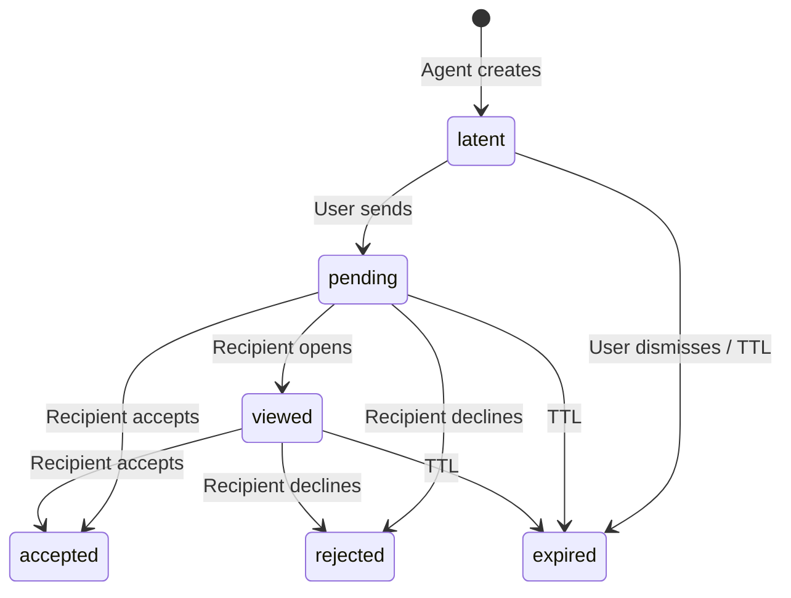
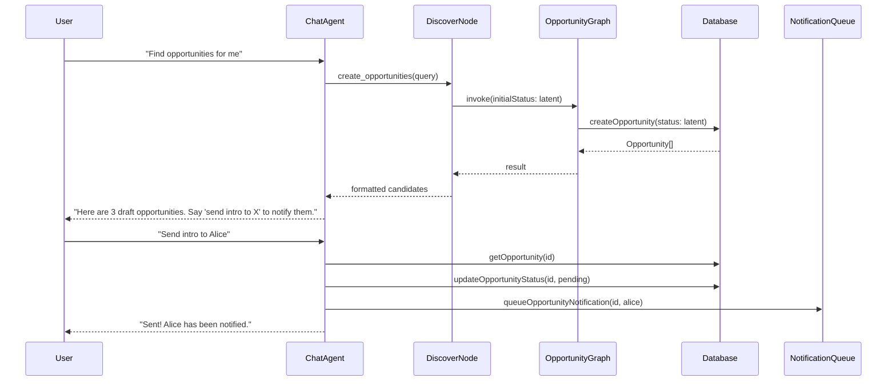
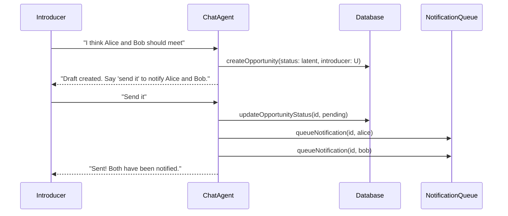

# Latent Opportunity Lifecycle

> **Status**: Design  
> **Related**: [Opportunity Graph README](../graphs/opportunity/README.md), [Chat Graph README](../graphs/chat/README.md)

## Motivation

Users should not create opportunities directly. Instead, the agent discovers, evaluates, and presents opportunities — and the user chooses to act on them (send, dismiss, or explore). This requires a new lifecycle state where opportunities exist but have not yet been shared with the other party.

### Target Experience

```
User:  "Hey agent, find opportunities for me"
Agent: "Sure, let me look..."
       - discovering mutual or complementary intents
       - filtering ideal candidates
       - evaluating best timing for each pair
       - checking if someone vouches for them
       - ranking opportunities (when there are many)
       "Here are your opportunities:" (or "No opportunities for you at this time.")

User sees draft opportunities → chooses to send or dismiss.
```

## Concept: Latent State

A **latent** opportunity is one that has been created by the agent but not yet shared with the other party. It is only visible to the source user (the one who asked for discovery) or the introducer (the one who suggested two people should meet).

### Lifecycle



| Status | Visible to source? | Visible to candidate? | Notifications? |
|--------|--------------------|-----------------------|----------------|
| latent | Yes | No | None |
| pending | Yes | Yes | Sent on transition from latent |
| viewed | Yes | Yes | None (already notified) |
| accepted | Yes | Yes | Confirmation to both |
| rejected | Yes | Yes | To source only |
| expired | Archive | Archive | None |

### Key Rules

1. **Agent creates, user sends.** The `create_opportunities` tool and `create_opportunity_between_members` tool both create opportunities in `latent` state. No notifications are sent at creation time.
2. **Explicit send.** A new `send_opportunity` tool (or UI action) promotes `latent` → `pending` and triggers notifications to the other party.
3. **No silent sharing.** An opportunity never reaches the candidate until the source/introducer explicitly sends it.

## Data Flow

### Discovery Flow (agent-driven)



### Curator Flow (user suggests two people should meet)



## Changes to Existing Components

### Opportunity Status Enum

Add `latent` as the first value in `opportunityStatusEnum`:

```typescript
export const opportunityStatusEnum = pgEnum('opportunity_status', [
  'latent', 'pending', 'viewed', 'accepted', 'rejected', 'expired'
]);
```

### Opportunity Graph

The `persistOpportunitiesNode` accepts an `initialStatus` option (defaults to `'pending'` for backward compatibility). When invoked from discovery, callers pass `initialStatus: 'latent'`.

### Chat Tools

| Tool | Before | After |
|------|--------|-------|
| `create_opportunities` (renamed from find_opportunities) | Persists as `pending` | Persists as `latent` via `initialStatus` option |
| `create_opportunity_between_members` | Creates as `pending`, sends notifications | Creates as `latent`, no notifications |
| `send_opportunity` | (new) | Promotes `latent` → `pending`, queues notifications |
| `list_my_opportunities` | Returns all statuses | Returns all statuses with clear draft/sent distinction |

### Agent Behavior

After finding opportunities, the agent tells the user:
- How many draft opportunities were found
- That they can say "send intro to [name]" to notify the other person
- That opportunities start as drafts until explicitly sent

## Future Extensions

- **Timing signals**: Add temporal awareness to the evaluator (e.g. "this person just posted about looking for a co-founder").
- **Vouch checking**: Before presenting an opportunity, check if anyone in the index vouches for the candidate.
- **Batch send**: Allow sending multiple draft opportunities at once.
- **Auto-expire latent**: Cron job to expire latent opportunities after N days if not sent.
- **UI integration**: Frontend card view for draft opportunities with send/dismiss actions.
